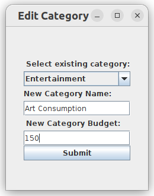

# Expenditure Tracker

## Table of Contents

- [Overview](#overview)
- [Key Features](#key-features)
- [Usage](#usage)
  - [Installation](#installation)
  - [Screens](#screens)
- [Implementation](#implementation)
  - [Code Structure](#code-structure)
  - [Testing](#testing)
  - [JavaDoc](#javadoc)
- [Clean Architecture Specifications](#clean-architecture-specifications)
  - [Clean Architecture Violations](#clean-architecture-violations)
  - [SOLID Principles](#solid-principles)
  - [Design Patterns](#design-patterns)
- [Authors](#authors)

## Overview

The Expenditure Tracker is a Java application designed to help users manage their expenses throughout a given month. 
This intuitive program offers an array of features that allow users to track, organize, and evaluate their expenditures,
while also providing insightful data analysis for informed financial decision-making.

## Key Features

- **Expense Creation and Editing:** Users can submit and edit numerous expense entries, ensuring an accurate 
representation of their spending patterns.

- **Categorization:** This program enables users to efficiently categorize their expenses, resulting in a well-organized
financial overview. Moreover, users customize their categories to allow for precise sorting of expenses according to 
individual spending habits.

- **Budget Allocation:** Users set a predetermined budget for the month, enhancing financial discipline. Additionally, 
budgets are created per category, allowing for stricter financial management based on user preference.

- **Month Menu:** A user-friendly menu where all expense tracking is facilitated. The month menu is the hub for 
expense and category creation, viewing previous expense logs, and generating the graphical summary. 

- **Graphical Monthly Reports:** A comprehensive graphical representation of the user's spending distribution. 
Generating easy-to-understand graphs through UI frameworks, users gain a visual insight into their financial allocation 
across different categories.

- **Persistent Data Storage:** This program ensures continuity by storing user data onto their local file system, 
allowing access and maintenance across various sessions. This feature guarantees that the financial history and insights
accumulated remain preserved and accessible over time.

## Usage

### Installation

1. Clone the repository: `git clone https://github.com/CSC207-2023Y-UofT/course-project-DoorKeepers.git`
2. Locate local file in your terminal or open in an IDE.
3. Navigate to the correct directory: `cd src/main/java`
4. Compile the project: `javac Main.java`
5. Run the project: `java Main`

### Screens

## Implementation

### Code Structure
The whole project is built by following the MVC design pattern. We have divided our classes into three main packages:
`entities`, `use_cases`, and `views`. The three of them correspond to different layers of Clean Architecture.

Firstly, the `entities` package corresponds to the Enterprise Business Rules layer. It contains all the basic entity
object types (`Expense`, `Category`, `MonthlyStorage`, `SessionStorage`), an exception type used for errors related to
the entities (`EntityException`), and the factory classes used to build `Category` and `Expense` objects.

Secondly, the `use_cases` package corresponds to the Application Business Rules layer. It contains the use case
interactors for all of our features, and their corresponding input boundary, input data, output boundary, and
output data. In addition, the `generate_summary_use_case` subpackage contains an extra class used to help in generating
the statistical data it needs, and the `session_load` subpackage also contains an interface used to communicate with our
file storage gateway.

Finally, the `views` package corresponds to both the Interface Adapters, and Frameworks & Drivers layers. It contains
the view, controller and presenter classes for all of our features. Additionally, this package also holds our
file storage gateway, which is the class that handles loading and saving session files.

There is a `Main` file outside the packages, which builds the program windows and screens, and displays the UI.

### Testing
This project uses JUnit as its testing framework. All the tests are contained inside the `src/test/java` directory.
It contains tests for the entity classes, use case interactor classes, and the file storage gateway. It doesn't contain
any tests for most of our `view` package, since the classes contained in it are view, presenter, and controller classes.
View classes contain UI elements that can't really be tested in any way other than by being looked at, and 
presenter/controller classes only pass data around without much logic to be tested.

To run tests: 
1. Open the project in IntelliJ.
2. Open the 'Project' panel on the left.
3. Right-click `src/main/test` directory and select `Run 'Tests in 'course-project-DoorKeepers.test''`

To run any specific testing class, navigate to it in the 'Project' panel in IntelliJ, right-click it, and 
select `Run 'ClassNameTest'`.

Test coverage can be seen below:

The full report is contained inside the `reports/coverageReport` directory.

### JavaDoc
The project uses the JavaDoc framework to provide documentation for all of our methods, classes, and interfaces. 
This documentation is written into the code, but we also provide generated documentation pages inside our 
`reports/JavaDoc` directory.

## Clean Architecture Specifications

### Clean Architecture Violations
- `Expense` and `Category` are basic object types we have for conveying information that are not separable. 
For instance, an expense called "Walmart" would have no meaning unless we know the specific amount of money spent 
shopping in Walmart. These classes belong to the Entity layer, but are passed around in both the `use_case` and `views` 
packages, which is a Clean Architecture violation. We could remove the imports to these entities, and change the output
data to `Object[][]` type in the `UpdateViewUseCaseInteractor` to accommodate Java Swing requirements. 
However, we thought it is not adhering to SOLID principle from the point that `Object[][]` may not be the type required 
by other view libraries that could be imported, which is in contrary to the Open/Closed Principle.
- `SessionStorage` is an object type used to hold all information contained in the user's session. Every time a use case 
is called, the interactor of that use case needs to access the information within the `SessionStorage` object. Thus, it 
needs to be passed throughout all layers of our program, despite being a violation of Clean Architecture.

### SOLID Principles
- **Single Responsibility Principle:** All classes are acted upon by a single actor and adhere to this principle.
- **Open-Closed Principle:** Since our classes with main functionality implement Input Boundary and Output Boundary
interfaces, the user is able to modify any interactor or presenter as they see fit. For example, if the user wanted to 
implement another view that generates statistical data with all months they could create another interactor to do that.
- **Liskov Substitution Principle:** All of our Input Boundary and Output Boundary objects adhere to this principle. 
In order to adhere to the Dependency Inversion Principle, the interactors and presenters are cast to the Input Boundary 
and Output Boundary, respectively. This demonstrates the LSP, as any class that implements these interfaces can be used.
- **Interface Segregation Principle:** All of our interfaces adhere to this rule, as they are all small and contain only
the necessary methods needed.
- **Dependency Inversion Principle:** All classes have a boundary between every layer in Clean Architecture, to create 
the dependency inversion.

### Design Patterns
- All of our features are implemented using the MVC design pattern. We chose the MVC design pattern to help us organize
our code in a way that clearly separates the Clean Architecture layers. The Model, View, and Controller concepts
in MVC clearly separate responsibilities, and they organize dependencies such that they only point inwards. 
Furthermore, using MVC for all our features helped us keep them with a consistent structure, even if they
were implemented separately.
- The Factory design pattern is used to implement the Add/Edit Category and Add/Edit Expense features. We chose to add 
this implementation to avoid tight coupling between the creators (`ExpenseUseCaseInteractor` and 
`CategoryUseCaseInteractor`) and their products (`Expense` and `Category`). This choice helps our code adhere to the 
Open/Closed Principle, since we can introduce new types of `MonthObject`s into the code and avoid breaking our current
implementation. Additionally, it adheres to the Single Responsibility Principle, as the product creation code is moved
to a separate class, allowing the Use Case Interactors to focus on error handling and post-creation tasks.

## Authors
This project was created by Ari, Katarina, Lulu, and Yin for [CSC207] Software Design at the University of Toronto.
